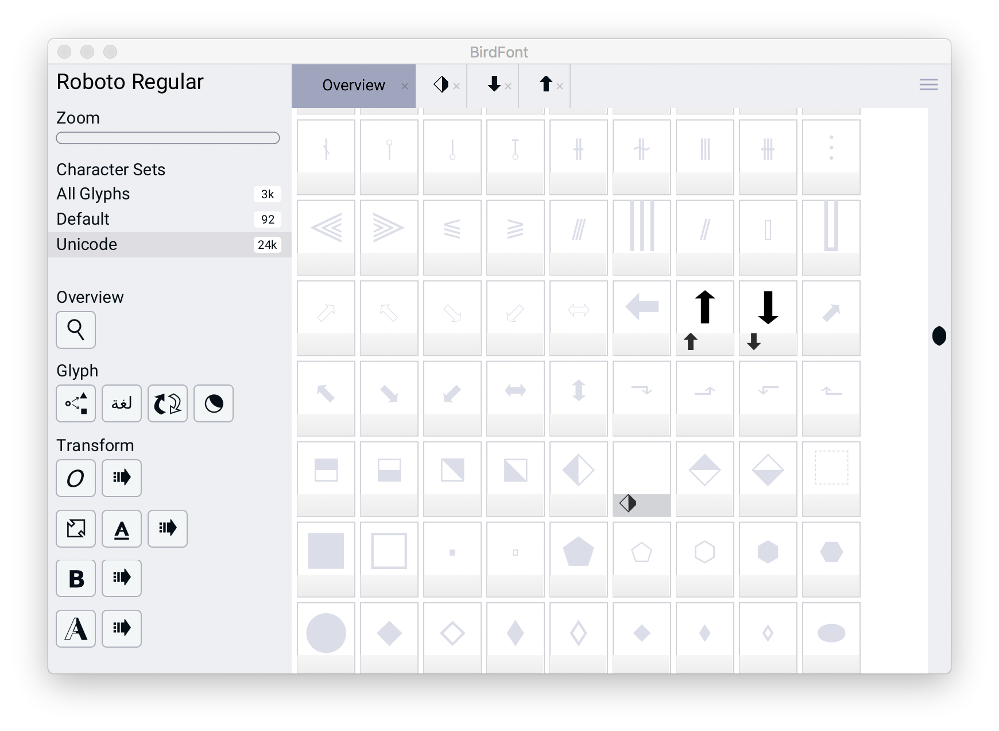
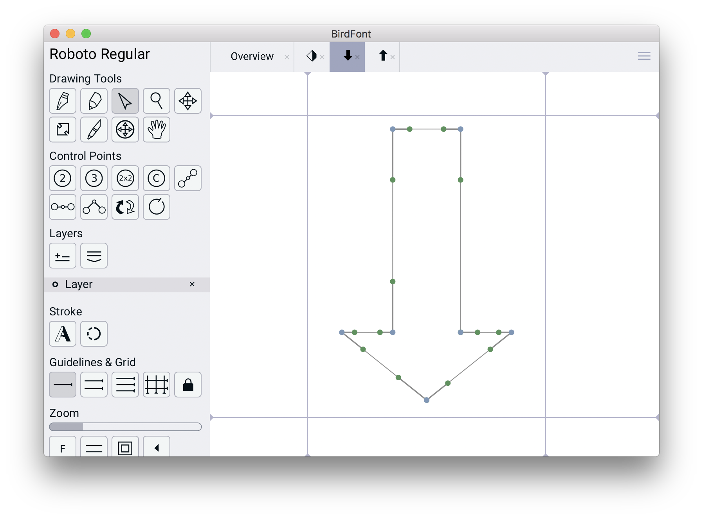

Ever wanted to add your own glyphs to a font? It's surprisingly easy once you know the. I chose [BirdFont](https://birdfont.org/) as my font editor after a cursory look over the free options. It did not disappoint:

In the screenshot above, I'm out the unicode weeds, but you should be able to see the two glyphs I added: ⬆️ and ⬇️. Adding the glyphs was super easy -- I found my .ttf, opened it in BirdFont, navigated to the empty code point in the Overview pane (unused code points show a default version of the glyph but in a light, light gray), double-clicked to open and began doing some vector drawing:

Once the glyph looks how you like, press ⌘+E to export back to .ttf. Load your new font file up on your website, and you're done -- new glyphs for your font!
